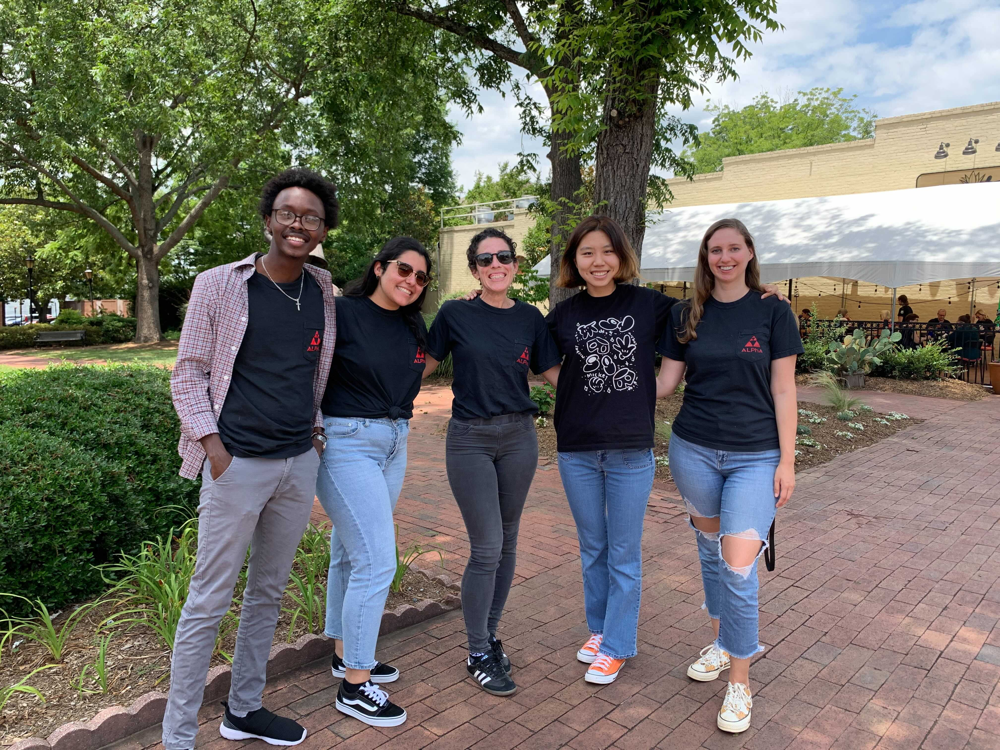
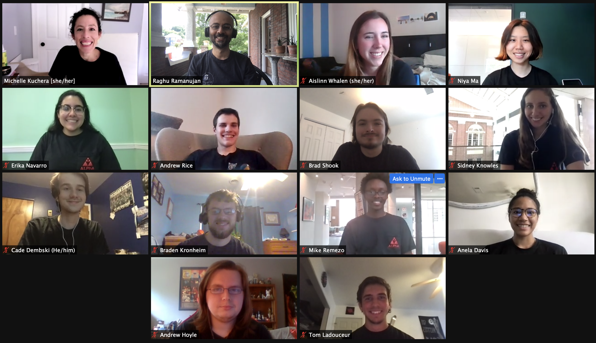
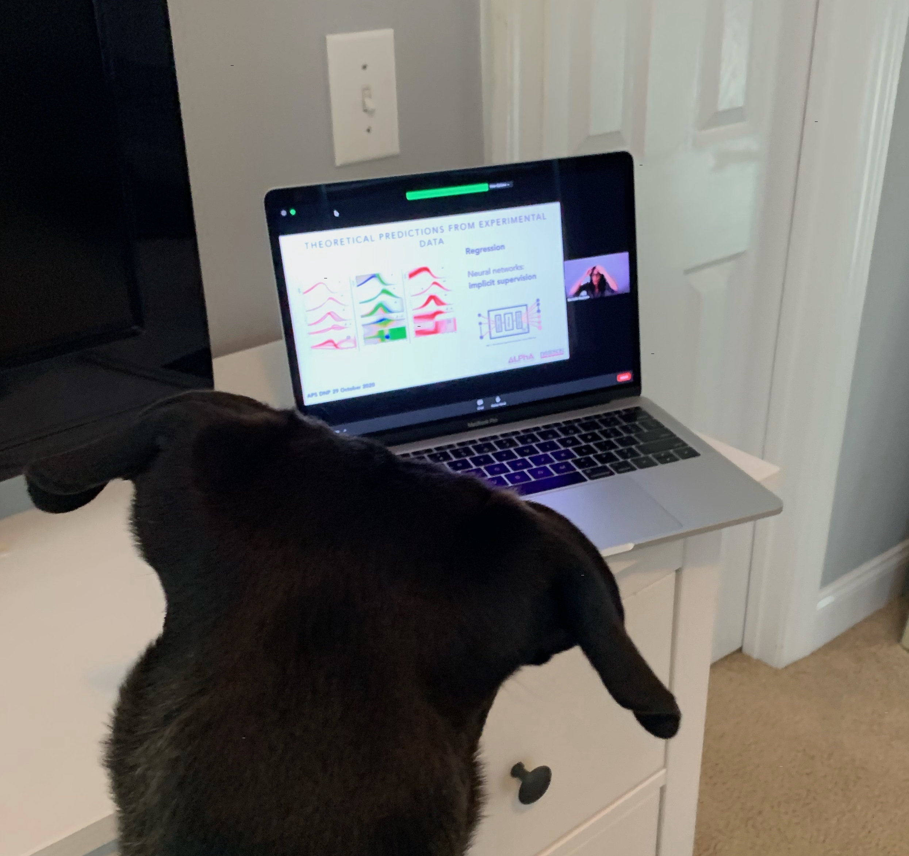
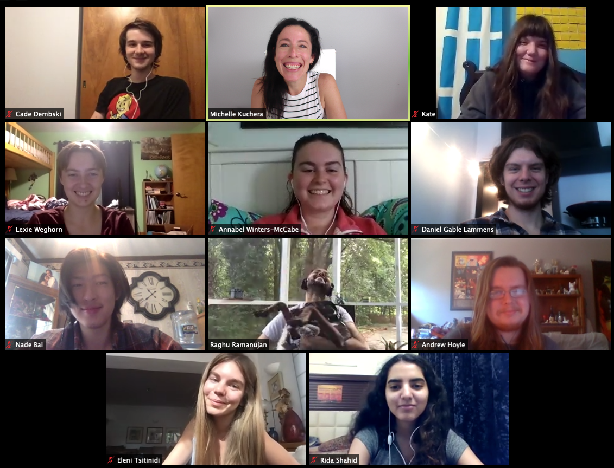
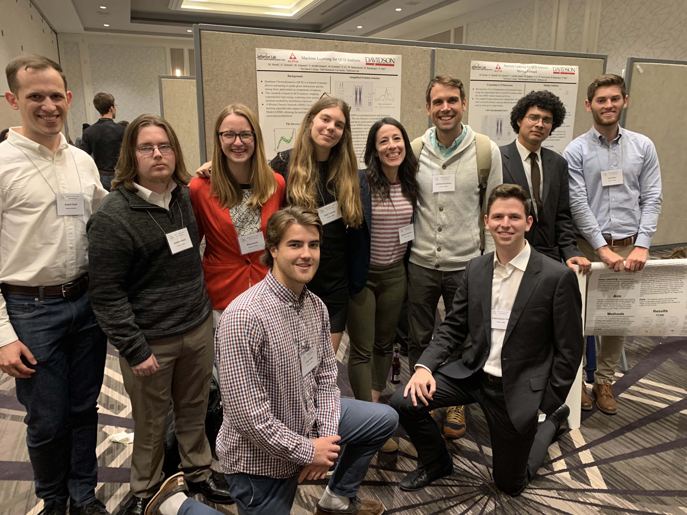
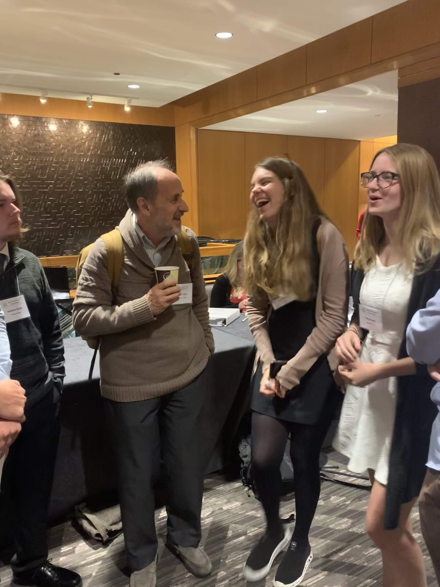
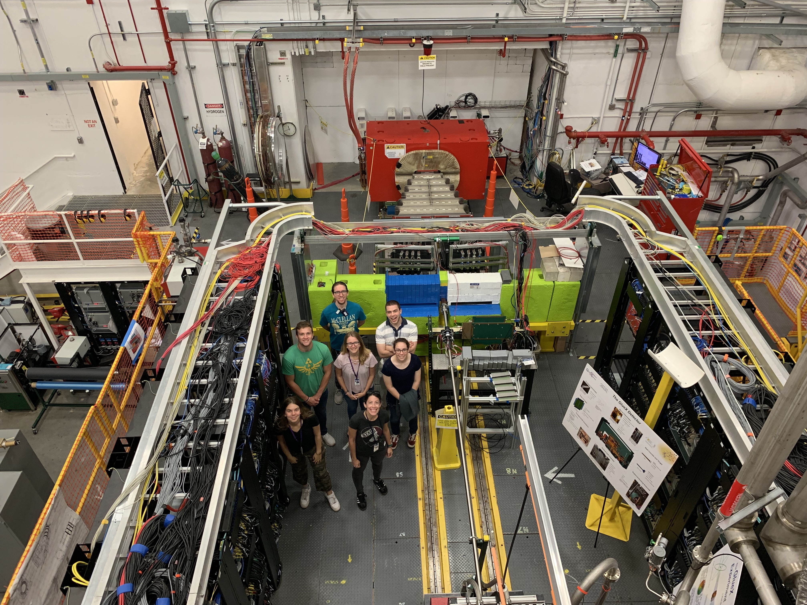
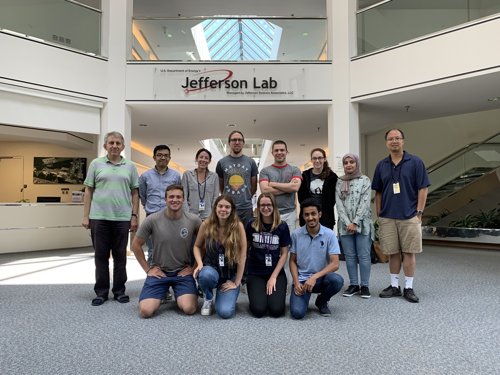
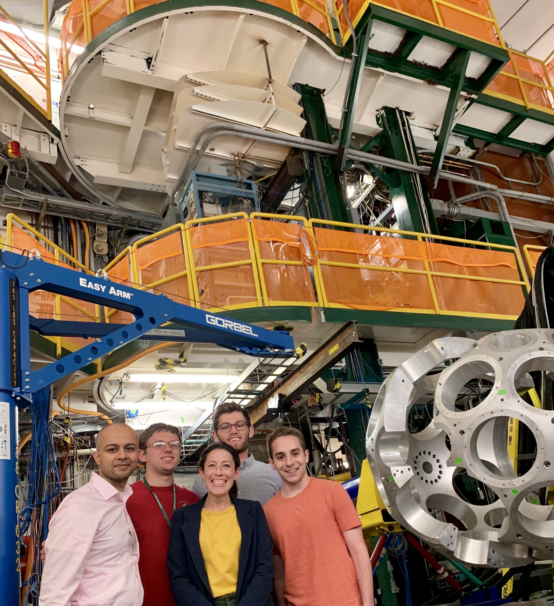
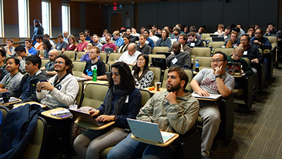

# News

---------------
*August 2021*

### ALPhA concludes a successful summer research program
For the second year in a row, the ALPhA summer program was primarily virtual. Twelve students worked in collaboration with scientists at the Facilty for Rare Isotope Beams, the Thomas Jefferson National Accelerator Facility, and CERN. 

<!-- John presented his work at the XXX, Braden presented his work at -->

---------------
*October 2020*
### ALPhA presents at the (virtual) 2020 American Physical Society Division of Nuclear Physics Conference

Dr. Michelle Kuchera and five ALPhA members from three instiutions presented their research at the APS DNP conference, which is held annually. This year's conference was virtual, and although we all wished we could be together in New Orleans, ALPhA's work drew a lot of interest in the community.

---------------
*August 2020*
### ALPhA summer research concludes

It wasn't a normal summer for anyone, including ALPhA. ALPhA's summer research went entirely virtual, with 9 students from 4 institutions working from locations around the world in collaboration with two national laboratories.

*The last ALPhA group meeting of the summer.*

---------------
*October 2019*
### ALPhA presents at the 2019 American Physical Society Division of Nuclear Physics Conference

Dr. Michelle Kuchera and five ALPhA members presented their research at the DNP conference, which is held annually. The 2019 conference was held in Washington, DC. 

*ALPhA students were accepted to present and participate in the Conference Experience for Undergraduates.*

*ALPhA students chatting with Dr. Sam L. Tabor, Dr. Michelle P. Kuchera's undergraduate advisor, who was awarded the 2019 DNP Mentoring Award at the conference.*

--------------
*July 2019*
### ALPhA travels to the Thomas Jefferson National Accelerator Facility to work with collaborators

Dr. Michelle Kuchera and four ALPhA members traveled to Newport News, VA to work with collaborators at the Thomas Jefferson National Accelerator Facility (Jefferson Lab) and Old Dominion University (ODU). 

*ALPhA on a tour of the Jefferson Lab experimental facilities.*

*ALPhA and our Jefferson Lab and ODU collaborators.*

--------------

*May 2019*
### ALPhA travels to the Facility for Rare Isotope Beams for Summer School and Collaboration

Dr. Raghu Ramanujan and Dr. Michelle Kuchera taught at the Facility for Rare Isotope Beams (FRIB) Theory Alliance Summer School in East Lansing, Michigan. ALPhA members attended at taching assistants and particpants. The group also spent time working with collaborators.

*ALPhA on a tour of the FRIB experimental facilities.*

*Students listen attentively to the summer school lectures. Graduate students and postdocs came from all over the U.S. and other countries to attend this school.*
